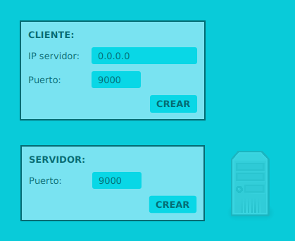
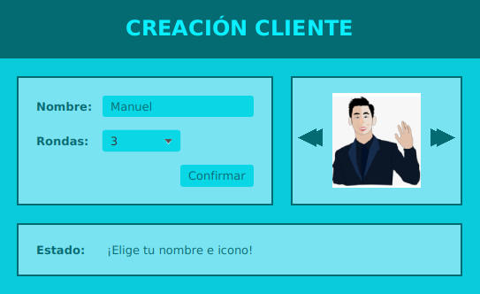
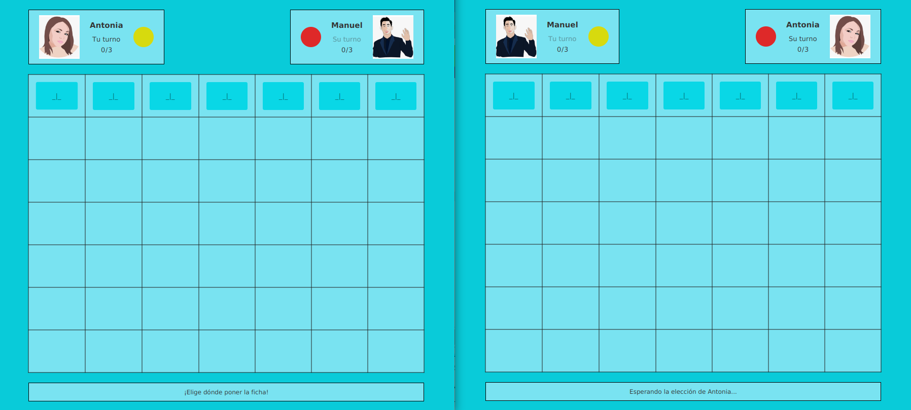
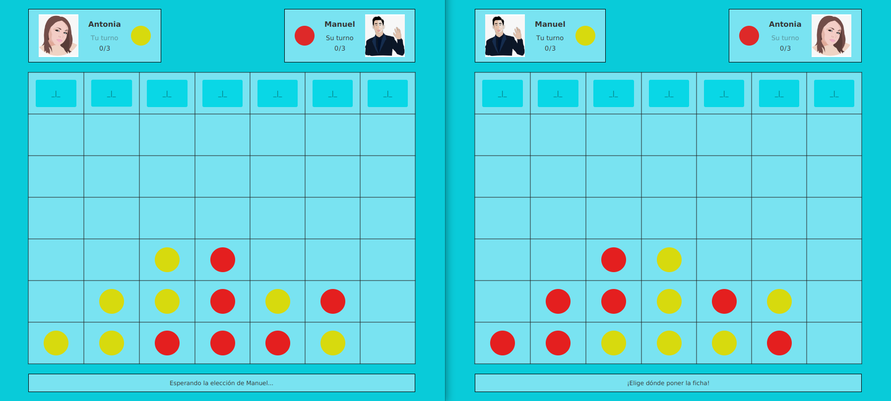

# FourInARowOnline

Juego Cuatro En Raya, estilo conecta cuatro. Permite jugar online mediante la conexión por sockets.

-> PÁGINA DE INICIO: te permite crear un servidor local o clientes.

-> SELECTOR CLIENTE: elige tu avatar, nombre y vota por el número de rondas a jugar(elegido al azar entre las elecciones de los jugadores).

-> PANTALLA PRINCIPAL: si es tu turno, coloca la ficha.

